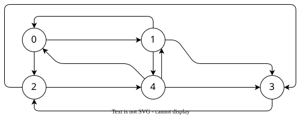
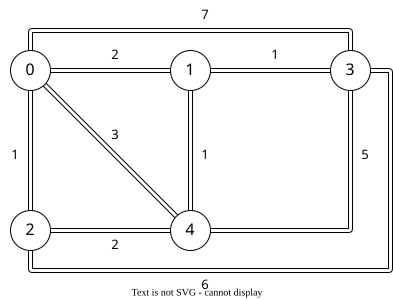

# Depth First Search

## Objective

To implement and analyze the Depth First Search (DFS) algorithm for graph traversal using an adjacency matrix representation.

## Theory

Depth First Search (DFS) is a graph traversal algorithm that explores as far as possible along each branch before backtracking. It uses a stack (explicit or implicit via recursion) to keep track of vertices.

## Time and Space Complexity

- Time Complexity: O(V + E), where V is the number of vertices and E is the number of edges.
- Space Complexity: O(V), due to the stack used in recursion or iteration.

## Algorithm (Pseudocode)

```py
def DFS(G, start):
    mark start as visited
    push start onto stack 

    while stack is not empty:
        current = pop from stack
        for each neighbor of current:
            if neighbor is not visited:
                mark neighbor as visited
                push neighbor onto stack
        print current
```

<div class="page-brake"></div>

## Diagram



## Implementation

```cpp
#include <stdio.h>
#include <stack>
using namespace std;

#define DIM 5

int graph[DIM][DIM] = {
    { 0, 1, 1, 0, 0 },  // 0
    { 1, 0, 0, 1, 1 },  // 1
    { 0, 0, 0, 1, 1 },  // 2
    { 0, 0, 1, 0, 0 },  // 3
    { 1, 1, 0, 1, 0 },  // 4
};


void dfs (int start) {
    int visited[DIM] = { 0 };
    stack<int> nodeStack;

    nodeStack.push(start);
    visited[start] = 1;

    while (!nodeStack.empty()) {
        int current = nodeStack.top();
        nodeStack.pop();
        
        for (int i = 0; i < DIM; i++) {
            if (!visited[i] && graph[current][i] == 1) {
                nodeStack.push(i);
                visited[current] = 1;
                break;
            }
        }
        
        printf("%d ", current);
    }
}


int main() {
    dfs(0);
}
```

## Output

```sh
0 1 3 2 4
```

# Breadth First Search

## Objective
To implement and analyze the Breadth First Search (BFS) algorithm for graph traversal.

## Theory
Breadth First Search (BFS) explores vertices level by level using a queue.

## Time and Space Complexity
- Time Complexity: O(V + E)
- Space Complexity: O(V)

## Algorithm (Pseudocode)
```py
def BFS(G, start):
    mark start as visited
    enqueue start
    while queue is not empty:
        current = dequeue
        for each neighbor of current:
            if neighbor not visited:
                mark neighbor visited
                enqueue neighbor
        print current
```

<div class="page-brake"></div>

## Diagram


## Implementation

```cpp
#include <stdio.h>
#include <queue>
using namespace std;

#define DIM 5

int graph[DIM][DIM] = {
    { 0, 1, 1, 0, 0 },  // 0
    { 1, 0, 0, 1, 1 },  // 1
    { 0, 0, 0, 1, 1 },  // 2
    { 0, 0, 1, 0, 0 },  // 3
    { 1, 1, 0, 1, 0 },  // 4
};


void bfs (int start) {
    int visited[DIM] = { 0 };
    queue<int> nodeQueue;

    nodeQueue.push(start);
    visited[start] = 1;

    while (!nodeQueue.empty()) {
        int current = nodeQueue.front();
        nodeQueue.pop();
        
        for (int i = 0; i < DIM; i++) {
            if (!visited[i] && graph[current][i] == 1) {
                nodeQueue.push(i);
                visited[i] = 1;
            }
        }
        
        printf("%d ", current);
    }
}


int main() {
    bfs(0);
}
```

## Output

```sh
0 1 3 2 4
```

# Dijkstra’s Shortest Path Algorithm

## Objective

To implement Dijkstra’s algorithm for finding shortest paths from a source vertex.

## Theory

Dijkstra’s algorithm uses a priority queue to repeatedly select the vertex with minimum distance.

## Time and Space Complexity

- Time Complexity: O((V + E) log V) with priority queue
- Space Complexity: O(V)

## Algorithm (Pseudocode)

```py
def Dijkstra(G, source):
    initialize dist[source] = 0, others = ∞
    use priority queue
    while queue not empty:
        u = extract-min
        for each neighbor v of u:
            if dist[v] > dist[u] + weight(u,v):
                dist[v] = dist[u] + weight(u,v)
```

<div class="page-brake"></div>

## Diagram



## Implementation

```cpp
#include <iostream>
#include <cmath>
#define DIM 5
#define G INFINITY
using namespace std;

double graph[DIM][DIM] = {
    {G, 2, 1, 7, 3}, // 0
    {2, G, G, 1, 1}, // 1
    {1, G, G, 6, 2}, // 2
    {7, 1, 6, G, 5}, // 3
    {3, 1, 2, 5, G}, /* 4 */ };

double dp[DIM];

void dijkstra(int start) {
    int visited[DIM];
    int source = start;
    for (int i = 0; i < DIM; i++) { dp[i] = G; visited[i] = 0; }
    dp[source] = 0;

    cout << source << "\t";
    for (int i = 0; i < DIM; i++) cout << dp[i] << "\t";
    cout << endl;

    for (int i = 0; i < DIM; i++) {        
        for (int j = 0; j < DIM; j++) {
            dp[j] = min(dp[j], dp[source] + graph[source][j]);
            if (!visited[j]) cout << dp[j] << "\t";
            else cout << "\t"; }
        
        visited[source] = 1; double minDist = G;

        for (int j = 0; j < DIM; j++) {
            if (dp[j] < minDist && !visited[j]) {
                minDist = dp[j];
                source = j; } }
        cout << endl;
    }
}

int main()
{
    dijkstra(0);
}
```

## Output
```sh
0       0       inf     inf     inf     inf
0       0       2       1       7       3
2               2       1       7       3
1               2               3       3
3                               3       3
4                                       3
```

# Bellman-Ford Algorithm

## Objective

To implement and analyze the Bellman-Ford algorithm for finding shortest paths from a source vertex in a weighted graph, even when negative edge weights are present.

## Theory

The Bellman-Ford algorithm computes shortest paths by relaxing all edges repeatedly. Unlike Dijkstra’s algorithm, it can handle graphs with negative edge weights. If after \(V-1\) iterations a further relaxation is possible, the graph contains a negative weight cycle.

## Time and Space Complexity

- Time Complexity: O(V · E), where V is the number of vertices and E is the number of edges.
- Space Complexity: O(V)

## Algorithm (Pseudocode)

```py
def BellmanFord(G, source):
    initialize dist[v] = ∞ for all vertices v
    dist[source] = 0

    for i in range(1, V):
        for each edge (u, v) with weight w:
            if dist[u] + w < dist[v]:
                dist[v] = dist[u] + w

    # check for negative weight cycles
    for each edge (u, v) with weight w:
        if dist[u] + w < dist[v]:
            report "Negative weight cycle detected"
```

<div class="page-brake"></div>

## Diagram


## Implementation

```cpp
#include <iostream>
#include <cmath>
#define DIM 5
#define G INFINITY
using namespace std;

double graph[DIM][DIM] = {
    {G, 2, 1, 7, 1}, // 0
    {2, G, G, 1, 1}, // 1
    {1, G, G, 6, 2}, // 2
    {7, 1, 6, G, 5}, // 3
    {1, 1, 2, 5, G}, /* 4 */
    };
void bellman(int start) {
    double dp[DIM];
    for (int i = 0; i < DIM; i++) { dp[i] = G; }
    dp[start] = 0;

    for (int k = 1; k < DIM; k++) {
        for (int u = 0; u < DIM; u++) {
            for (int v = 0; v < DIM; v++) {
                    dp[v] = min(dp[v], dp[u] + graph[u][v]);
            }
        }
    }

    for (int u = 0; u < DIM; u++) {
        for (int v = 0; v < DIM; v++) {
            if (dp[u] + graph[u][v] < dp[v]) {
                cout << "Graph contains a negative weight cycle!" << endl;
                return;
            }
        }
    }

    for (int i = 0; i < DIM; i++) {
        cout << "Distance from " << start << " to " << i << " = " << dp[i] << endl;
    }
}


int main()
{
    bellman(0);
}
```

## Output
```sh
Distance from 0 to 0 = 0
Distance from 0 to 1 = 2
Distance from 0 to 2 = 1
Distance from 0 to 3 = 3
Distance from 0 to 4 = 1
```

# Floyd-Warshall Algorithm

## Objective

To implement and analyze the Floyd-Warshall algorithm for finding shortest paths between all pairs of vertices in a weighted graph using an adjacency matrix.

## Theory

The Floyd-Warshall algorithm is a dynamic programming technique that computes shortest paths between all pairs of vertices. It works by iteratively updating the adjacency matrix, considering each vertex as an intermediate point. It can handle negative edge weights but not negative cycles.

## Time and Space Complexity

- Time Complexity: O(V³), where V is the number of vertices.
- Space Complexity: O(V²), due to the distance matrix.

## Algorithm (Pseudocode)

```py
def FloydWarshall(G):
    dist = adjacency matrix of G
    for k in range(V):
        for i in range(V):
            for j in range(V):
                if dist[i][k] + dist[k][j] < dist[i][j]:
                    dist[i][j] = dist[i][k] + dist[k][j]
    return dist
```

<div class="page-brake"></div>

## Implementation

```cpp
#include <iostream>
#include <climits>
using namespace std;
#define V 4

void floydWarshall(int graph[V][V]) {
    int dist[V][V];

    for (int i = 0; i < V; i++)
        for (int j = 0; j < V; j++) dist[i][j] = graph[i][j];

    for (int k = 0; k < V; k++) {
        for (int i = 0; i < V; i++) {
            for (int j = 0; j < V; j++) {
                if (dist[i][k] != INT_MAX && dist[k][j] != INT_MAX
                    && dist[i][k] + dist[k][j] < dist[i][j]) {
                    dist[i][j] = dist[i][k] + dist[k][j];
                }
            }
        }
    }

    cout << "Shortest distances between every pair of vertices:" << endl;
    for (int i = 0; i < V; i++) {
        for (int j = 0; j < V; j++) {
            if (dist[i][j] == INT_MAX) cout << "INF" << " ";
            else cout << dist[i][j] << " ";
        }
        cout << endl;
    }
}

int main() {
    int graph[V][V] = {
        {0, 5, INT_MAX, 10},
        {INT_MAX, 0, 3, INT_MAX},
        {INT_MAX, INT_MAX, 0, 1},
        {INT_MAX, INT_MAX, INT_MAX, 0}
    };

    floydWarshall(graph);
    return 0;
}
```

## Output

```sh
Shortest distances between every pair of vertices:
0 5 8 9 
INF 0 3 4 
INF INF 0 1 
INF INF INF 0 
```
