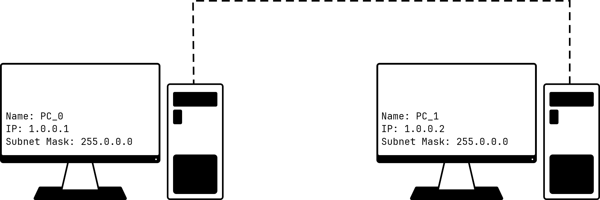
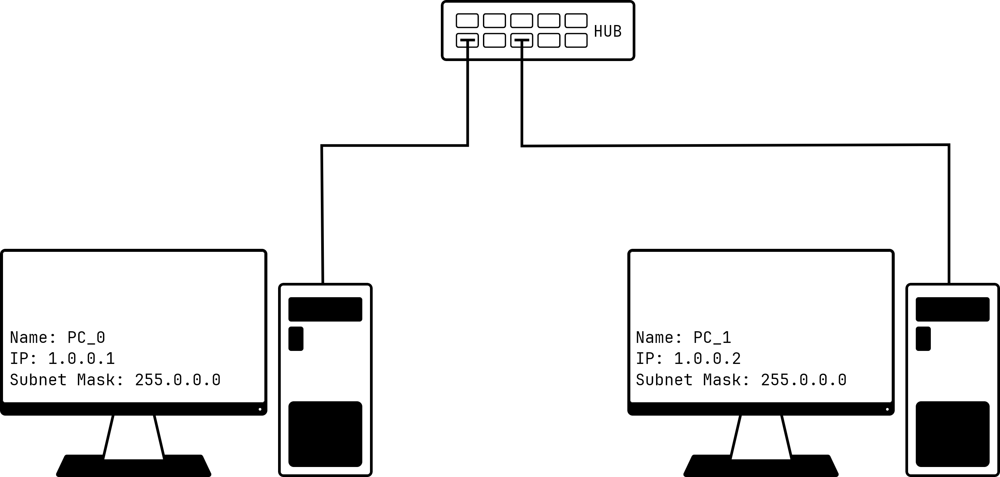

# Connecting Two Computers in a Point-to-Point Network

## Objective

1. Establish a point-to-point network between two computers.
2. Configure unique IPv4 addresses for both computers.
3. Verify connectivity by performing a bidirectional `ping` test.

## Theory

A point-to-point network directly connects two devices without an intermediate
switch or router. Each device must have a network interface card (NIC) and a
unique IP address in the same subnet. A crossover Ethernet cable is traditionally
used to connect two similar devices directly.

In this experiment, both computers belong to the network `1.0.0.0/8` and can
communicate directly because their addresses are in the same subnet. The `ping`
utility uses Internet Control Message Protocol (ICMP) echo request and echo reply
messages to test reachability. No default gateway is required because the
communication is limited to the local network.

## Apparatus and Software

1. Cisco Packet Tracer
2. One computer capable of running Cisco Packet Tracer
3. Two PC devices from the Packet Tracer end-device list
4. One copper crossover cable

## Network Topology

*Figure 1: PC_0 and PC_1 connected directly with a copper crossover cable.*

## IP Addressing Scheme

| Device | IP address | Subnet mask | Default gateway |
| --- | --- | --- | --- |
| PC_0 | `1.0.0.1` | `255.0.0.0` | Not required |
| PC_1 | `1.0.0.2` | `255.0.0.0` | Not required |

## Procedure

1. Open Cisco Packet Tracer and place two PC devices in the workspace.
2. Select **Connections**, choose a copper crossover cable, and connect the
	FastEthernet interface of `PC_0` to the FastEthernet interface of `PC_1`.
3. Open `PC_0`, select **Desktop > IP Configuration**, and enter the IP address
	`1.0.0.1` with subnet mask `255.0.0.0`.
4. Configure `PC_1` with IP address `1.0.0.2` and subnet mask `255.0.0.0`.
5. Open the command prompt on `PC_0` and execute: `ping 1.0.0.2`
6. Repeat the test from `PC_1` using: `ping 1.0.0.1`
7. Record the ping responses and confirm that packets are successfully exchanged
	in both directions.

## Observation and Result

| Source | Destination | Expected observation |
| --- | --- | --- |
| PC_0 (`1.0.0.1`) | PC_1 (`1.0.0.2`) | Four ICMP echo replies received; 0% packet loss |
| PC_1 (`1.0.0.2`) | PC_0 (`1.0.0.1`) | Four ICMP echo replies received; 0% packet loss |

The two computers were successfully connected in a point-to-point network. The
bidirectional ping tests verified that both devices could communicate.

## Discussion

Successful communication depends on a working physical connection, enabled NIC
interfaces, unique IP addresses, and both devices being in the same subnet. A
wrong cable type, duplicate IP address, or mismatched subnet mask can cause the
ping test to fail.

## Conclusion

Two computers were connected directly using a copper crossover cable and
configured with valid IPv4 addresses in the same subnet. Successful ping
replies confirmed the establishment of the network.

# Connecting Computers in a LAN using hub

## Objective

1. Establish a local area network (LAN) between two computers using a hub.
2. Configure unique IPv4 addresses for both computers.
3. Verify connectivity between the computers by performing a bidirectional
	`ping` test.

## Theory

A hub is a basic networking device that connects multiple computers in a LAN.
It operates at the Physical layer of the OSI model and forwards incoming
signals to all of its other ports. Each connected computer must have a network
interface card (NIC) and a unique IP address in the same subnet.

In this experiment, PC_0 and PC_1 are connected to a central hub using
copper straight-through cables. Both computers belong to the network
`1.0.0.0/8`, so they can communicate with each other through the hub. The
`ping` utility uses Internet Control Message Protocol (ICMP) echo request and
echo reply messages to test network reachability. No default gateway is
required because communication is limited to the local network.

## Apparatus and Software

1. Cisco Packet Tracer
2. One computer capable of running Cisco Packet Tracer
3. Two PC devices from the Packet Tracer end-device list
4. One hub
5. Two copper straight-through cables

## Network Topology

*Figure 2: PC_0 and PC_1 connected to a central hub using copper
straight-through cables.*

## IP Addressing Scheme

| Device | IP address | Subnet mask | Default gateway |
| --- | --- | --- | --- |
| PC_0 | `1.0.0.1` | `255.0.0.0` | Not required |
| PC_1 | `1.0.0.2` | `255.0.0.0` | Not required |

## Procedure

1. Open Cisco Packet Tracer and place two PC devices and one hub in the
	workspace.
2. Select **Connections**, choose a copper straight-through cable, and connect
	the FastEthernet interface of `PC_0` to an available port on the hub.
3. Connect the FastEthernet interface of `PC_1` to another available hub port
	using a second copper straight-through cable.
4. Open `PC_0`, select **Desktop > IP Configuration**, and enter the IP address
	`1.0.0.1` with subnet mask `255.0.0.0`.
5. Configure `PC_1` with IP address `1.0.0.2` and subnet mask `255.0.0.0`.
6. Open the command prompt on `PC_0` and execute: `ping 1.0.0.2`
7. Repeat the test from `PC_1` using: `ping 1.0.0.1`
8. Record the ping responses and confirm that packets are successfully
	exchanged in both directions.

## Observation and Result

| Source | Destination | Expected observation |
| --- | --- | --- |
| PC_0 (`1.0.0.1`) | PC_1 (`1.0.0.2`) | Four ICMP echo replies received; 0% packet loss |
| PC_1 (`1.0.0.2`) | PC_0 (`1.0.0.1`) | Four ICMP echo replies received; 0% packet loss |

The computers were successfully connected through the hub. The bidirectional
ping tests verified that both devices could communicate over the LAN.

## Discussion

Successful communication depends on a functioning hub, active NIC interfaces,
correct cable connections, unique IP addresses, and both computers being in the
same subnet. A hub repeats data to all connected ports, so it does not need an
IP address or configuration. A disconnected cable, duplicate IP address, or
mismatched subnet mask can cause the ping test to fail.

## Conclusion

Two computers were connected to a central hub using copper straight-through
cables and configured with valid IPv4 addresses in the same subnet. Successful
ICMP ping replies confirmed that the hub-based LAN was established.